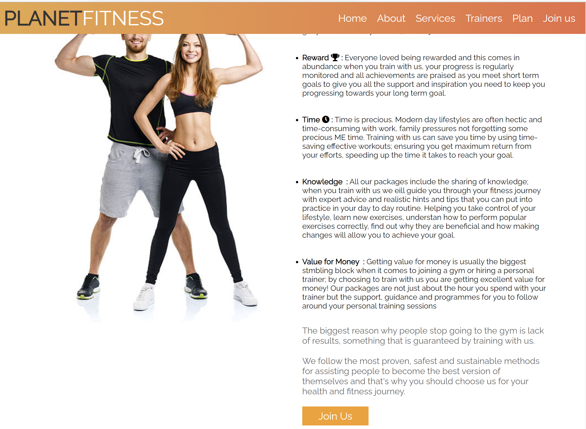

# Planet Fitness

## Objective

Planet Fitness is a front-end project for a responsive Gym website using HTML and CSS, experimenting with new fonts and styles. 
The website was designed to be simple and non fussy, it uses a one-page format, which makes it especially easy to navigate on mobile. An efficient and non fussy website will attract new menbers who would otherwise timeout trying to navigate a complicated website.
In this project I aim at showcasing my ability in HTML and CSS by developing a website which is visually pleasing and informative with intuitive navigation and a clear layout. 

Most Gym users are researching classes and availability during a busy day at work. They want instant access to information with little clicking and scrolling. This website has clear sections providing general information about what the gym offers to its members, from multiple gruop classes to a variety of professional equipment. Most Gym Website users are already attending a gym and just want to know some basic details.
The gym is interested in attracting and retaining members: the site's users are potential members, who want to know more about the gym and its procedures.
The different sections of the website provide welcoming images of the Gym.
The website promotes the image of a professional well run Gym.

***

## UX User Experience Design

### Overall User Experience

1. It has been designed as mobile first. The user may use a number of different sized devices and the media queries reflect this so that the aesthetics of the site remain looking okay, and the site is accessible and readable across the majority of screen sizes.
2. The user can expect the header and menu to stay in the same position on every page so the title of the site is visible and the menu is always displayed at the top right of the page making navigation easy and consistent for the user.
3. The image on the home page gives an indication as to what the site is about and the text helps increasing motivation.
4. The footer remains the same format and contains the same information for every page and device ensuring that the user can always access the gym's social profiles.
5. The site is clearly set out with each page title making it clear to the user what the content will be.
6. The site is also provided with a clear easily found timetable with attractive and vibrant colours, to address the user's need to know at what time the gym is open and can therefore be attended.
7. The register section allows the user to send messages to the gym for any additional queries.

### Design Choices

#### Colours

I used a combination of contrasting colours so that the text and images would stand out clearly against the background. I used dark colours, such as #000 and #333, for most of the sections' backgrounds and #fff and #ff9f1a for details, such as borders and text.
I used the colour picker to choose the hover colour on the button for the contact form. I wanted the colour to compliment the images I used for the different sections.

#### Typography

I used [Google Fonts](https://fonts.google.com/) for the font [Raleway](https://fonts.googleapis.com/css?family=Raleway), which I felt looked contemporary, strong and professional, keeping the content clear and readable.

#### Images

I was inspired by the use of [Font Awesome Icons](https://fontawesome.com/icons) in the Love Running Project section of the course, so I decided to make each of the list items of the about section more eye-catching with a relevant icon, copying the HTML code for each icon before posting it into the relevant text. All the images I used for my project were taken from [Pexels](https://www.pexels.com/) and [Unsplah](https://unsplash.com/). I tried to use images which had orange and black elements to compliment the site's colour palette choices.

#### Animations and Transitions

When you first open the home page the background image zooms in slightly, which adds a fun element and draws the viewers eye to the image and text within the image. I learnt how to do this whilst doing the Love Running Project within the course and used those learnt skills to implement it in my own project. The home section is also provided of a button, which links the user directly to the register section, with a motivational text rather than "join us" or "register", to give the user a more inspiring and intriguing feel right from the beginning. I made the button turn orange when hovered on; I am very interested in what CSS can offer in terms of interactivity and I felt it added a pleasing visual to the navigation experience.
I want the menu to have a contemporary feel; to achieve this I provided each menu item with a hover effect, to highlight what menu page you can select before you have selected it.
It was important to me that the site didn't become too cumbersome, so most of the content was added in the about section, whilst all of the other sections are provided with specific buttons which link the user to the about page to learn more about everything there is to know about the gym. All buttons are provided with the same hover effect.
Finally, when navigating the website on a mobile phone, at a certain screen width, the menu items disappear and turn into a clickable hamburger menu, which turns orange when hovered on as well.
Multiple identical hover effects are added throughout the website, for example in both the services and trainers section.
All the pictures have a responsive design for smaller screen sizes, ultimately placing them one on top of another other, which gives a cleaner layout than having the picture next to each other.

### Features

#### Home section

I used the Raleway font to add to the strong and clean feel of the site. I wanted an image behind the text to aid visual impact and chose a quite neutral image in terms of colour, as it is almost entirley black. I want the text to be wide and brief so that it did not overlay the image too much, leaving it clearly visible behind it. I had originally started with a different image but the colours were too colorful and made both the header and the text not prominent enough, detracting from the overall look I was going for.I wanted to make this concisive, with an image that is relevant to the title of the site. I added the zoom-in of the image and the text fade-in to make it more engaging.

#### Footer section

I made the footer really simple, with a plain black background and orange clickable icons in contrast so as to be clear this was less important than the header and content of the website. I added a Facebook, Twitter, Instagram and Youtube link to each of the correspondent icon.
Above the footer I embedded a google maps, which is set of course to a random location, so the user can easily figure out where the gym is sited. I also added a box on the top right of the map containing the gym's phone number and hours of operation and decorated each voice with an icon.

#### About section

This section provides detailed information on the gym, explaining what the gym can offer to its members, listing multiple reasons why to choose to become a member, prefering it over competition, and strongly underlining what the gym believes in.
As the opening section is very dramatic this was kept simple so the reader is not distracted from the text. I went for a white background to achieve this, as well as the same font for headings and paragraphs.

#### Register section

I liked the idea of having a background image which was fairly muted in terms of the choices of colours and I think this image was perfect. Also it leads nicely onto the register form, which I kept very simple but still functional. The register section makes sure that users complete all mandatory fields before submission enabling good customer communication and Gym feedback.

## Testing

### Validation Testing

1. [CSS Validator with CSS Portal](https://www.cssportal.com/css-validator/)
   

2. [HTML Validator with Free Formatter](https://www.freeformatter.com/html-validator.html)
   

### Cross Browser and Cross Device Testing

I have loaded the website in Chrome, Safari and Firefox. Each browser displayed the site as I designed it to, and the responsive design is functioning as I intended.
I have used a number of mobile device sizes in dev tools to ensure the website functions and appears OK across a number of devices.
I have inputted various formats of data into the form on the contact page, and the form requires all sections to be completed including a full email; if these things are not completed correctly it returns an error message. I have purposely not made the consent button as a required input.  When the form is submitted a new page is displayed thanking the user.
I've tested all the anchor elements for external links and ensured they open in a new browser tab.  I've also tested the internal anchor elements and ensured they go to the relevant pages within the site.
I've manually tested the user requirements as outlined in [Overall User Experience](#Overall-User-Experience).
I've ran my site through Lighthouse's audit [Web Dev](https://web.dev.measure/) and the results are below:

### Bugs

### Accessibility

I ran my site through [Web Accessibility](https://www.webaccessibility.com/) showing all okay.

I also ran it through [Wave](https://wave.webaim.org/) Web accessibility evaluation tool and it is showing all okay.
***

## Deployment

***

## Languages 

1. HTML

2. CSS

## Tools

1. [Font Awesome](https://fontawesome.com/)
    
2. [Pexels](https://www.pexels.com/)

3. [Unsplah](https://unsplash.com/)

4. [Chrome DevTools](https://developer.chrome.com/docs/devtools/)
    
5. [Google Fonts](https://fonts.google.com/)

6. [HTML Color Codes](www.https://htmlcolorcodes.com)

7. [Lighthouse's audit](https://web.dev.measure/)
    
8. [Web Accessibility](https://www.webaccessibility.com/)

9. [Wave](https://wave.webaim.org/)
    
10. [W3C Markup Validation Service](validator.w3.org)
***

## Credits

### Media

- As mentioned above, all images were taken from [Pexels](https://www.pexels.com/) and [Unsplah](https://unsplash.com/).

### Acknowledgments

- I want to acknowledge my mentor Richard Williams, who has challenged me and provided insight into some issues I faced. His help and support has been invaluable to me, especially at the start of the project when I was suffering from Imposter Syndrome and he was able to guide me through the process and make me believe in my abilities again. I have quickly learnt with Richard that he will not simply give me the answers but will be a guiding light in times of need!
- I used [W3Schools](https://www.w3schools.com/html/html_forms.asp) as a general guide throughout, and it has proven helpful when I have encountered problems or simply for the times I wanted to add different elements within my project and didn't know how to.
- The format of this README file came from the Code Institute.
- The template for this project is the Code Institute student template for Gitpod.
- Help to accomplish the responsive hamburger menu by using pure CSS came from the following website provided by my mentor: (https://alvarotrigo.com/blog/hamburger-menu-css/); this was extremely useful and interesting to learn.

### Personal Development

- I have come so far whilst doing this project, and although I have sought help as highlighted above, I often preferred to try and work it out for myself. This has proved time consuming but my knowledge has increased ten-fold, and even when I'm not sure exactly how to solve an issue, I am finding that I am often on the right track in my efforts. I realise that I have so, so much to learn and am already looking back at this project and seeing how I could have done things better and I'm sure there is some code in my CSS which is not relevant, but even so I am proud of what I have achieved. One of the most outstanding mistakes I made is probably the lack of commits; in this first project I found it challenging getting used to committing often, basically every tiny thing I did, and ended up with a total of only 4 commits in occasion of my second session with my mentor. He immediately pointed that out and I have done my best to fix it since, though I am aware I should still commit much.
 
